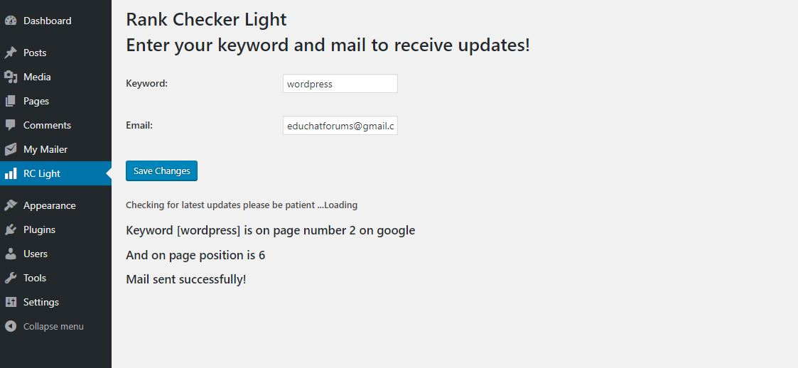

It is a simple Wordpress plugin which check your specified keyword ranking for your site in google. It will take a little time on slow server if you open the plugin page. Result will be displayed on plugin page for the specified keyword and also it will send the result to your specified email. It doesn't effects your site loading performance. 
<b>You don't need to access dashboard for checking your ranking, it has a cron job you will be notified once in a day through email.</b>  

<ul>
  <li>Install it</li>
  <li>Specify Keyword</li>
  <li>Specify Mail</li>
  <li>Save Changes</li>
  <li>Done!</li>
</ul>
